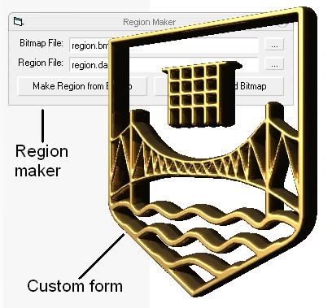



## Region Maker: Create, Save and Load Regions to Completely Re\-Shape Your Forms\!

### Description

Region Maker is an extremely useful and powerful tool that can completely re-shape forms. See the screenshot for an example, using a partially transparent 3D version of my school's logo. The package includes a tool to create regions (which is the part that defines the shape of the form) from bitmaps and then save them to a file to be used later. The included class module allows you to easily load the region back to any form to reshape it in the way that YOU want it to!
 
### More Info
 

             |
---                |---
**Submitted On**   |2004-06-12 06:06:02
**By**             |[Craig Bonathan](https://github.com/Planet-Source-Code/PSCIndex/blob/master/ByAuthor/craig-bonathan.md)
**Level**          |Advanced
**User Rating**    |5.0 (20 globes from 4 users)
**Compatibility**  |VB 5\.0, VB 6\.0
**Category**       |[Graphics](https://github.com/Planet-Source-Code/PSCIndex/blob/master/ByCategory/graphics__1-46.md)
**World**          |[Visual Basic](https://github.com/Planet-Source-Code/PSCIndex/blob/master/ByWorld/visual-basic.md)
**Archive File**   |[Region\_Mak1756466122004\.zip](https://github.com/Planet-Source-Code/craig-bonathan-region-maker-create-save-and-load-regions-to-completely-re-shape-your-forms__1-54335/archive/master.zip)

